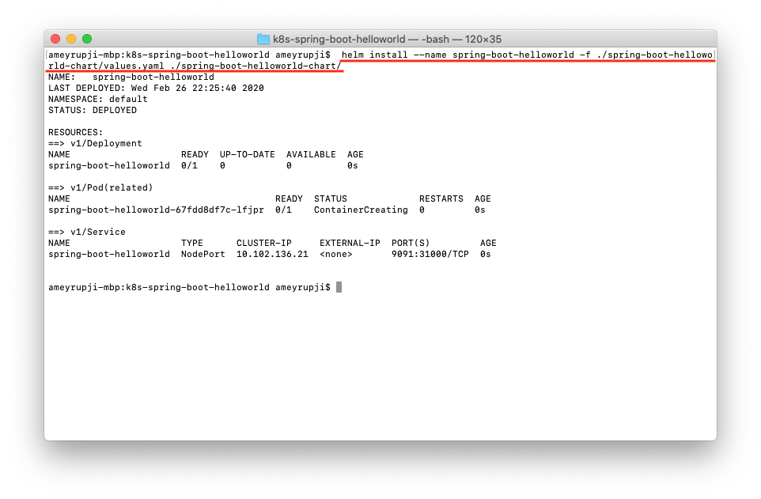
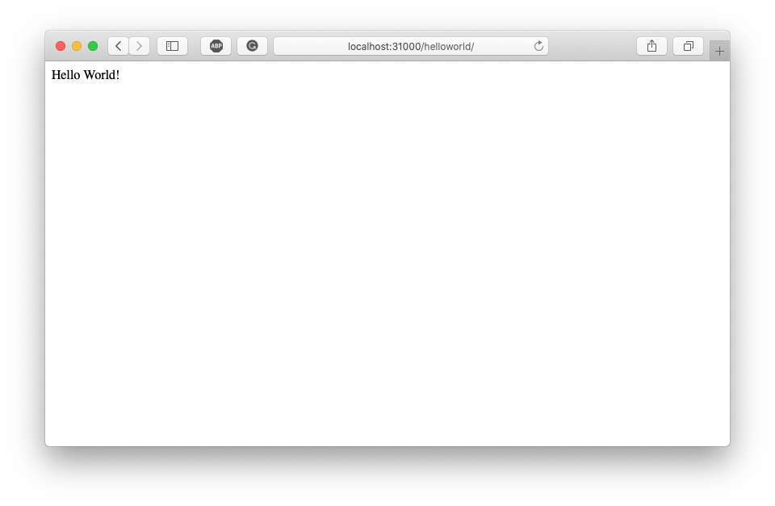
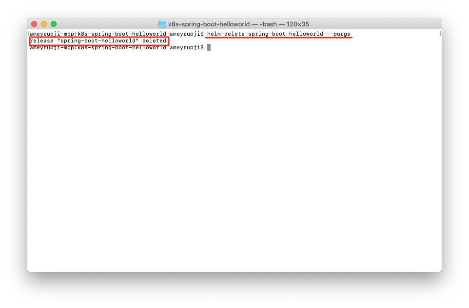

# K8s-spring-boot-helloworld

Taking the Basic Hello World Application in Spring Boot! further. This example creates a docker container containing a Spring Boot application with a Controller that returns "Hello World!" which gets deployed to a kubernetes luster using helm.


## Prerequisites

- Java IDE (I am using IntelliJ CE)
- Maven
- Docker
- Helm
- Tiller on the Kubernetes cluster

## System Configuration at time of test

- macOS Catalina - Version 10.15.3 (19D76)
- IntelliJ CE - Version CE 2019.3
- Maven - Version 3.6.1
- Docker Desktop - Version 2.2.0.3 (42716)
- Kubernetes - v1.15.5
- Helm - v2.14.3

## Initial Setup

### Installing tiller

Run the folloewing commands to install tiller if already not installed on your local cluster 

```shell script
kubectl -n kube-system create serviceaccount tiller

kubectl create clusterrolebinding tiller \
  --clusterrole cluster-admin \
  --serviceaccount=kube-system:tiller

helm init --service-account tiller
```

### Creating Spring project

Follow the steps outlined in [docker-spring-boot-helloworld](https://github.com/ameyrupji/docker-spring-boot-helloworld) GitHub project to create a Spring Boot docker container. 

The basic commands required to create a container are"

```
mvn clean install
docker build -t spring-boot-helloworld:v1 .
```

### Adding Helm charts

Making the docker container ready to be deployed on kubernetes using helm create the necessary charts by running command `helm create {chart name}` in this case the chart name should be same as the the project name in this case `spring-boot-helloworld`. This will create a folder with that name and add default chart templates.

Look the modified code in the `spring-boot-helloworld` directory. The files to look at are `templates/deployment.yaml`, `templates/service.yaml`, and `values.yaml`. The application is exposed on port `31000` which is defines as the `nodePort` value in the `values.yaml` file.


### Validate the created charts

To validate the created helm charts run the following command:

`helm lint ./spring-boot-helloworld/`


### Run Helm Install

`helm install --name spring-boot-helloworld -f ./spring-boot-helloworld-chart/values.yaml ./spring-boot-helloworld-chart/`


`helm list`



`helm upgrade helloworld ./helm`


## Test 


Run the following command to ensure the server is running: `curl http://localhost:31000/helloworld/`

You can also view it in the browser by going to `http://localhost:31000/helloworld/` and following response will show up:



## Cleanup


To stop the container that is running use this command: `helm delete --purge spring-boot-helloworld`



## Useful links

- https://github.com/ameyrupji/docker-nginx-static-html-demo
- https://stackify.com/guide-docker-java/
- https://helm.sh/docs/helm/

